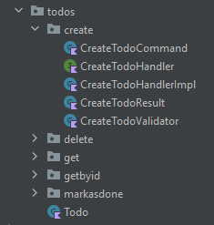
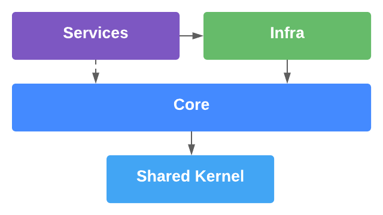

## Kotlin Clean Architecture

## How to Run
The solution is not already containerized so there are some dependencies you must configure to run the application:
- **JDK 17**
- **SQL Server Database**
  1. Set credentials on **Connection.kt** in **infra** project
  2. Use the **create.sql** script on **sql** directory.

## Introduction

A sandbox where I will experiment with new techniques, concepts, and technologies. Here you will find some DDD, CQRS, Clean Architecture, Event-Driven Architecture, Serverless, Microservices, RabbitMQ, gRPC, SOLID, Design Patterns, and more.

## 1. Architecture

For the app architecture I'm using a **Clean Architecture** model, splitting the solution into: **Core**, **Infra**, **Services** and **Package** layers. To control layers communication I've used **Gradle** to develop a **Multi-Project** architecture.

 
 

### Core
The **Core** layer is responsible for the **Domain Entities**, **Value Objects**, **Domain Services**, **Domain Events** and **Use Cases**.

The organization is based upon **Screaming Architecture** concept by Uncle Bob that purposes that your application architecture should scream what the system does. So I've preferred an organization by context rather than by component type.

Other principle that I've followed was **CQRS/CQS**, so the **Use Cases** are divided into **Write** or **Read** operations. Also, any **Use Cases** has his owns **Command**, **Query**, **Result** and **Handler**, this last only for **orchestration concerns**.

The main focus is to keep the Domain isolated from external details.
 

### Infra
The Infra Project is responsible for **Repository Concerns** (**Schemas**, **Repository Implementations**, and **Database Connection**), **Dependency Injection** and **External Providers** for integration or services consumption.

### Services
These are projects that consumes the **Core Use Cases**. Can be **APIs**, **gRPC Services**, **Serverless Functions**, **Console Applications** or **MVCs**. As the domain does not depend upon, the consumption can be anything.

### Shared Kernel
These are common resources that needs to be used between application layers, like **Common Packages**. This project is used to avoid circular dependencies between the other projects.

## 2. Dependencies Structure

## 3. Packages and Frameworks
The idea was treat **Frameworks**, **Database**, and **Services(api)** as details. So, I've avoided to use big frameworks and dependent services. For example, to build the API I've chosen **Ktor** and only used **routing** and **request parsing**, so it's easier to replace with other framework or technology.

- [Gradle](https://gradle.org/) - Build Management
- [Ktor](https://ktor.io/) - Web Framework
- [Koin](https://insert-koin.io/) - Dependency Injection
- [Ktorm](https://www.ktorm.org/) - Object Relational Mapper (ORM)
- [Konform](https://www.konform.io/) - Input Validation

## 4. Used Patterns and Principles
- [Clean Architecture](https://blog.cleancoder.com/uncle-bob/2012/08/13/the-clean-architecture.html)
- [CQRS/CQRS](https://martinfowler.com/bliki/CQRS.html)
- [SOLID](https://blog.cleancoder.com/uncle-bob/2020/10/18/Solid-Relevance.html)
- [Domain Validation](https://martinfowler.com/articles/replaceThrowWithNotification.html)
- [Fail-Fast Principle](https://enterprisecraftsmanship.com/posts/fail-fast-principle/)
- [Repository Pattern](https://docs.microsoft.com/en-us/dotnet/architecture/microservices/microservice-ddd-cqrs-patterns/infrastructure-persistence-layer-design)

## 5. Next Steps
1. Add new endpoints
2. Add tests
3. Containerization with **Docker**, **Docker Compose** and **Kubernetes**
4. Integrate with **Message Broker**
5. **Serverless** example
6. **CI/CD** pipeline with **GitHub Actions**
7. **Authentication**/**Authorization**
